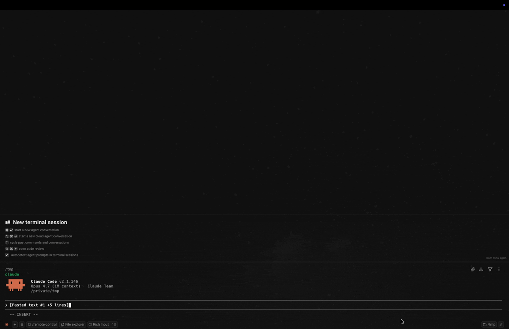
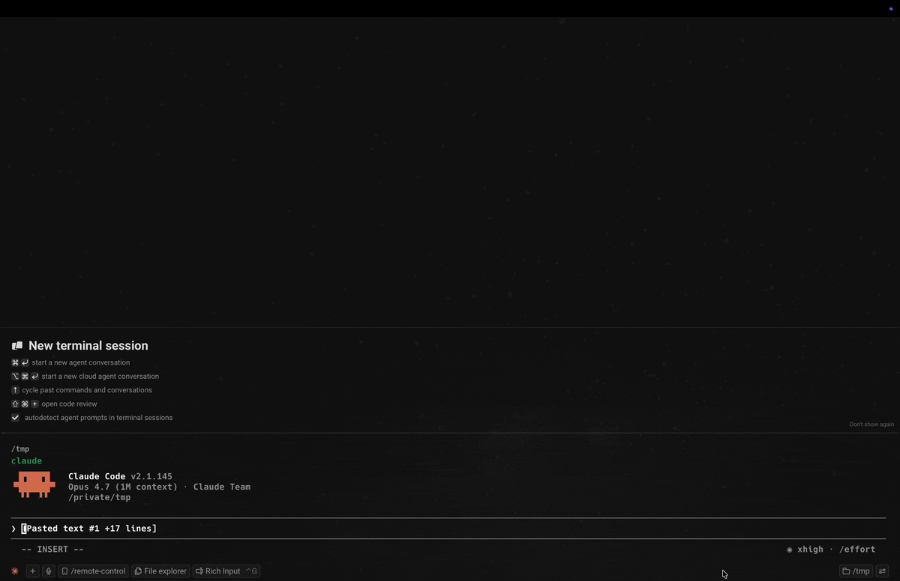

# octen-mcp

[](https://www.npmjs.com/package/octen-mcp)
[](https://www.npmjs.com/package/octen-mcp)
[](LICENSE)
[](https://github.com/Octen-Team/octen-mcp/actions/workflows/ci.yml)

MCP server for **[Octen Extract](https://docs.octen.ai/api-reference/extract)** — turn any URL into clean, LLM-ready markdown. Plug into Claude / Cursor / VS Code / Windsurf and let the model pull the live web.

## Why this MCP

Most extract tools (Firecrawl, Exa web_fetch, Tavily extract) hand you the page body. Octen gives you more, per page, in one call:

- **`highlights`** — pass a `query` and get the most relevant snippets ranked, not the whole page (cheaper context, better signal)
- **`category`** — topical classification `{primary, secondary}`
- **`page_structure`** — page typology `{primary, secondary}` (article / product / listing / index / …)



## Quick start

You need an Octen API key — grab one at [octen.ai](https://octen.ai).

### Claude Desktop

Edit `~/Library/Application Support/Claude/claude_desktop_config.json` (macOS) or `%APPDATA%\Claude\claude_desktop_config.json` (Windows):

```json
{
  "mcpServers": {
    "octen": {
      "command": "npx",
      "args": ["-y", "octen-mcp"],
      "env": {
        "OCTEN_API_KEY": "your-key-here"
      }
    }
  }
}
```

Quit and reopen Claude Desktop. Ask "fetch octen.ai and summarize" — Claude routes to the `extract` tool automatically.

### Cursor

Add to `~/.cursor/mcp.json`:

```json
{
  "mcpServers": {
    "octen": {
      "command": "npx",
      "args": ["-y", "octen-mcp"],
      "env": { "OCTEN_API_KEY": "your-key-here" }
    }
  }
}
```

### VS Code

[](https://vscode.dev/redirect/mcp/install?name=octen&inputs=%5B%7B%22type%22%3A%22promptString%22%2C%22id%22%3A%22apiKey%22%2C%22description%22%3A%22Octen%20API%20Key%22%2C%22password%22%3Atrue%7D%5D&config=%7B%22command%22%3A%22npx%22%2C%22args%22%3A%5B%22-y%22%2C%22octen-mcp%22%5D%2C%22env%22%3A%7B%22OCTEN_API_KEY%22%3A%22%24%7Binput%3AapiKey%7D%22%7D%7D)
[](https://insiders.vscode.dev/redirect/mcp/install?name=octen&inputs=%5B%7B%22type%22%3A%22promptString%22%2C%22id%22%3A%22apiKey%22%2C%22description%22%3A%22Octen%20API%20Key%22%2C%22password%22%3Atrue%7D%5D&config=%7B%22command%22%3A%22npx%22%2C%22args%22%3A%5B%22-y%22%2C%22octen-mcp%22%5D%2C%22env%22%3A%7B%22OCTEN_API_KEY%22%3A%22%24%7Binput%3AapiKey%7D%22%7D%7D&quality=insiders)

The button prompts you for the API key on click — no manual editing needed. Or add to `.vscode/mcp.json` in your workspace:

```json
{
  "servers": {
    "octen": {
      "command": "npx",
      "args": ["-y", "octen-mcp"],
      "env": { "OCTEN_API_KEY": "your-key-here" }
    }
  }
}
```

### Claude Code (CLI)

One line, no JSON editing:

```bash
claude mcp add --scope user octen \
  -e OCTEN_API_KEY=your-key-here \
  -- npx -y octen-mcp
```

`--scope user` makes it available from any directory. Verify with `claude mcp list` — should show `octen: ✓ Connected`.

### Windsurf / Cline / other MCP clients

Same `npx -y octen-mcp` command with `OCTEN_API_KEY` env — works in any MCP-compatible client.

## Tool reference: `extract`

| Param | Type | Default | Description |
|---|---|---|---|
| `urls` | `string[]` | required | 1–20 URLs per call. Bare hosts like `octen.ai` are auto-prefixed with `https://`. |
| `query` | `string` | _none_ | Intent-focused keywords. When set, results contain `highlights` instead of `full_content`. Max 500 chars. |
| `max_age_seconds` | `int` | `86400` | Cache TTL in seconds (min 300). Lower this for time-sensitive pages (news, prices). |
| `format` | `markdown` \| `text` | `markdown` | Output content format. |
| `timeout` | `int` | `30` | Per-URL extraction timeout, 1–60 seconds. |
| `include_images` | `bool` | `false` | Include image URLs found on each page. |
| `include_videos` | `bool` | `false` | Include video URLs found on each page. |
| `include_audio` | `bool` | `false` | Include audio URLs found on each page. |
| `include_favicon` | `bool` | `false` | Include each page's favicon URL. |

Full API reference: [docs.octen.ai/api-reference/extract](https://docs.octen.ai/api-reference/extract).

## Example prompts to try

- `Fetch octen.ai and summarize the main product features.`
- `Compare the positioning of firecrawl.dev and octen.ai.`
- `What does the Hacker News front page say right now? Pull the top 5 story titles.`
- `Search 'pricing' across firecrawl.dev — return only the relevant highlights.` _(triggers `query` → `highlights`)_

## How Octen handles edge cases

Real web pages fail in messy ways. Octen surfaces structured signals so your LLM agent can decide what to do, instead of guessing from an empty markdown blob.

| Scenario | Example URL | Octen response | Why it's useful |
|---|---|---|---|
| **Hard 404** | `https://httpbin.org/status/404` | `status: failed`, `error_message: "Target returned HTTP 404"` | Agent knows the URL is dead — no need to retry. |
| **Server error (5xx)** | `https://httpbin.org/status/500` | `status: failed`, `error_message: "Target server error (HTTP 500)"` | Distinguishes server-side outage from client-side dead page — can be safely retried later. |
| **DNS failure / dead domain** | `https://nonexistent-zzz-fake-xyz.invalid` | `status: failed`, `error_message: "Failed to resolve domain"` | Distinguishes "domain doesn't exist" from "page doesn't exist" — different remediation. |
| **Login wall / no main content** | `https://github.com/login` | `status: success`, `title: "Build software better, together"`, **`page_structure: "No Main Content"`**, `full_content: 602 bytes` | ✨ Even when the request succeeds and there's a title, `page_structure` flags pages with no real body. Agents can branch on this instead of feeding the LLM a useless login splash. |

The last row is the Octen-specific win: most extract tools would return `status: success` + a short body for that login wall and your agent has no signal it's garbage. Octen's `page_structure` classifier tells you upfront.



## Environment variables

| Variable | Required | Default | Notes |
|---|---|---|---|
| `OCTEN_API_KEY` | ✅ | — | Get one at [octen.ai](https://octen.ai) |
| `OCTEN_API_URL` | optional | `https://api.octen.ai` | Override for staging or self-hosted |

## Local development

```bash
git clone https://github.com/Octen-Team/octen-mcp.git
cd octen-mcp
npm install
npm run build
OCTEN_API_KEY=<key> npm run inspect    # opens MCP Inspector
```

## Tip — make Claude prefer this tool

If your client also has a built-in web-fetch tool, drop a hint in Claude Desktop's **Customize** / Project Instructions:

> When the user asks to fetch or extract content from a URL, prefer the `extract` tool from the `octen` MCP server. Use `query` whenever the user is looking for something specific on the page (returns ranked highlights, not the whole body).

## License

[MIT](LICENSE) © Octen
