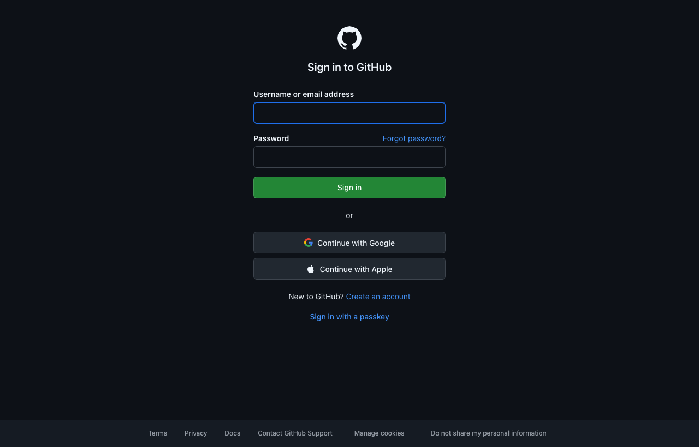
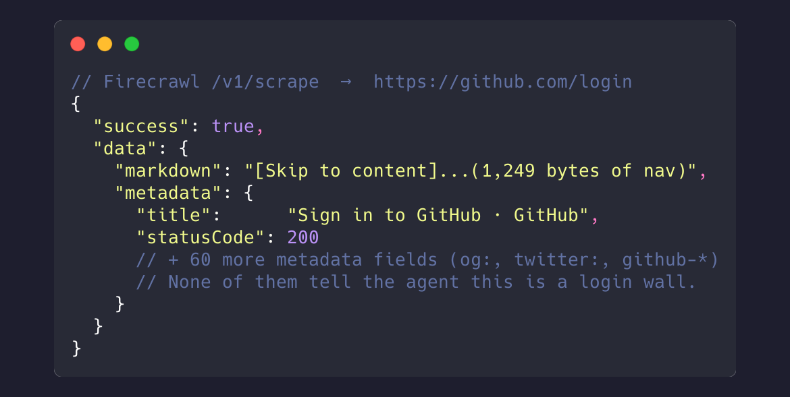
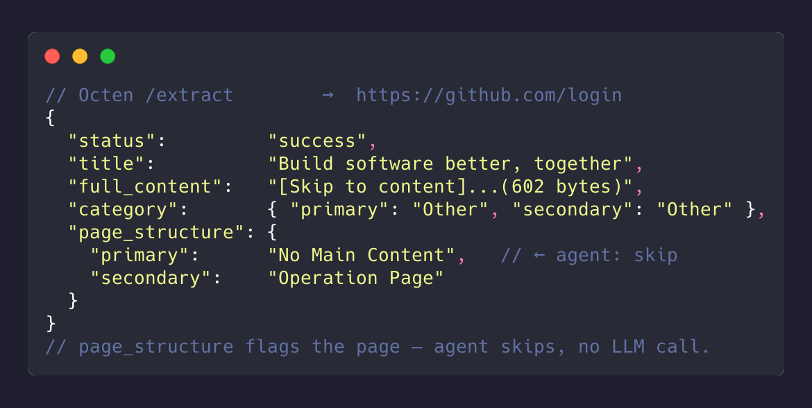

# octen-mcp

[](https://www.npmjs.com/package/octen-mcp)
[](https://www.npmjs.com/package/octen-mcp)
[](LICENSE)
[](https://github.com/Octen-Team/octen-mcp/actions/workflows/ci.yml)

MCP server for **Octen** — **[search](https://docs.octen.ai/api-reference/search)** the live web and **[extract](https://docs.octen.ai/api-reference/extract)** any URL into clean, LLM-ready markdown. Plug into Claude / Cursor / VS Code / Windsurf and let the model pull the live web.

## Why this MCP

Most extract tools (Firecrawl, Jina Reader, Exa, Tavily) hand you the page body. Octen returns the body **plus structured page labels** in the same call:

- **`category`** — topical labels with subcategories (e.g., `Computers, Electronics & Technology / Artificial Intelligence`, `Health`, `Finance`, `Travel`). Use to skip out-of-vertical pages in RAG pipelines — a finance pipeline can filter out random forum / entertainment pages before embedding.

- **`page_structure`** — what kind of page this actually is (e.g., `Content Page / Article`, `Homepage`, `Index Page`, `No Main Content`). Use to skip listing/navigation pages, dead links, and login-wall shells before paying for LLM calls — in real RAG pipelines, a meaningful share of fetched URLs (often 20–30%) are index pages or content-less shells.

- **`highlights`** — pass a `query` and get the most relevant snippets ranked per page instead of the full body (cheaper context, better signal).

The two labels move filtering upstream — instead of fetching everything, embedding it, then realizing a chunk of pages are useless, you skip them at fetch time. None of `category` / `page_structure` / `highlights` exist in Firecrawl, Jina, Exa, or Tavily today.

### When `success` isn't enough

A common failure mode for extract pipelines: the request returns `success`, the response body is non-empty, but the page is actually a login wall, paywall, JS shell, or "we'll be right back" stub. The agent has no signal until it pays for an LLM call to discover the page has nothing to summarize. Octen flags these at fetch time.

Take `https://github.com/login` — visually it looks like a normal page:

<p align="center"></p>

But there's no main content to extract — it's a sign-in form. Same URL on both APIs returns very different signals:

<table>
<thead>
<tr>
<th width="50%">Firecrawl <code>/v1/scrape</code></th>
<th width="50%">Octen <code>/extract</code> (this server)</th>
</tr>
</thead>
<tbody>
<tr>
<td valign="top"></td>
<td valign="top"></td>
</tr>
</tbody>
</table>

That single `page_structure: "No Main Content"` lets the agent skip the page without an LLM call. With other tools, the agent only finds out by spending tokens to summarize an empty page — at scale, a real chunk of the token bill.

## Quick start

[](https://vscode.dev/redirect/mcp/install?name=octen&inputs=%5B%7B%22type%22%3A%22promptString%22%2C%22id%22%3A%22apiKey%22%2C%22description%22%3A%22Octen%20API%20Key%22%2C%22password%22%3Atrue%7D%5D&config=%7B%22command%22%3A%22npx%22%2C%22args%22%3A%5B%22-y%22%2C%22octen-mcp%22%5D%2C%22env%22%3A%7B%22OCTEN_API_KEY%22%3A%22%24%7Binput%3AapiKey%7D%22%7D%7D)
[](https://insiders.vscode.dev/redirect/mcp/install?name=octen&inputs=%5B%7B%22type%22%3A%22promptString%22%2C%22id%22%3A%22apiKey%22%2C%22description%22%3A%22Octen%20API%20Key%22%2C%22password%22%3Atrue%7D%5D&config=%7B%22command%22%3A%22npx%22%2C%22args%22%3A%5B%22-y%22%2C%22octen-mcp%22%5D%2C%22env%22%3A%7B%22OCTEN_API_KEY%22%3A%22%24%7Binput%3AapiKey%7D%22%7D%7D&quality=insiders)

VS Code users: click → the button prompts for your Octen API key on install (grab one at [octen.ai](https://octen.ai) first).

For other clients, configure manually:

### Claude Desktop

Edit `~/Library/Application Support/Claude/claude_desktop_config.json` (macOS) or `%APPDATA%\Claude\claude_desktop_config.json` (Windows):

```json
{
  "mcpServers": {
    "octen": {
      "command": "npx",
      "args": ["-y", "octen-mcp"],
      "env": {
        "OCTEN_API_KEY": "your-key-here"
      }
    }
  }
}
```

Quit and reopen Claude Desktop. Ask "fetch octen.ai and summarize" — Claude routes to the `extract` tool automatically.

### Cursor

Add to `~/.cursor/mcp.json`:

```json
{
  "mcpServers": {
    "octen": {
      "command": "npx",
      "args": ["-y", "octen-mcp"],
      "env": { "OCTEN_API_KEY": "your-key-here" }
    }
  }
}
```

### VS Code (workspace `.vscode/mcp.json`)

The one-click badges above handle the user-level install. For a per-workspace config:

```json
{
  "servers": {
    "octen": {
      "command": "npx",
      "args": ["-y", "octen-mcp"],
      "env": { "OCTEN_API_KEY": "your-key-here" }
    }
  }
}
```

### Claude Code (CLI)

One line, no JSON editing:

```bash
claude mcp add --scope user octen \
  -e OCTEN_API_KEY=your-key-here \
  -- npx -y octen-mcp
```

`--scope user` makes it available from any directory. Verify with `claude mcp list` — should show `octen: ✓ Connected`.

### Windsurf / Cline / other MCP clients

Same `npx -y octen-mcp` command with `OCTEN_API_KEY` env — works in any MCP-compatible client.

## Tool reference: `search`

Search the live web and get back ranked results with snippets — pick broad vs. news search, filter by domain / text / time, and decide how much content each result returns.

| Param | Type | Default | Description |
|---|---|---|---|
| `query` | `string` | required | Search query. Max 500 chars. |
| `topic` | `general` \| `news` | `general` | Broad web search vs. news-focused results. |
| `count` | `int` | `5` | Number of results, 1–100. |
| `include_domains` | `string[]` | _none_ | Only return results from these domains. Max 1000, each ≤30 chars. |
| `exclude_domains` | `string[]` | _none_ | Drop results from these domains. Max 150, each ≤30 chars. |
| `include_text` | `string[]` | _none_ | Only results whose content contains all of these strings. Max 5, each ≤30 chars. |
| `exclude_text` | `string[]` | _none_ | Drop results whose content contains any of these strings. Max 5, each ≤30 chars. |
| `time_basis` | `auto` \| `published` \| `crawled` | `auto` | Which timestamp the time window filters against. |
| `time_range` | `day` \| `week` \| `month` \| `year` (or `d`/`w`/`m`/`y`) | _none_ | Relative time window. Mutually exclusive with `start_time`/`end_time` (absolute wins). |
| `start_time` / `end_time` | `string` | _none_ | Time window bounds, ISO 8601. |
| `format` | `text` \| `markdown` | `text` | Format of returned content. |
| `safesearch` | `off` \| `strict` | `strict` | Adult-content filter. |
| `highlight` | `object` | _server default_ | `{ enable, max_tokens }` — ranked snippet per result (`max_tokens` 100–20000, default 512). |
| `full_content` | `object` | _off_ | `{ enable, max_tokens }` — cleaned full page body per result (`max_tokens` 100–100000, default 2048). Heavier; use when the snippet isn't enough. |
| `include_images` | `bool` | `false` | Return image URLs (and a cover image) per result. |
| `include_videos` | `bool` | `false` | Return video URLs per result. |
| `timeout` | `int` | _none_ | Request timeout in seconds, 1–60. |

Full API reference: [docs.octen.ai/api-reference/search](https://docs.octen.ai/api-reference/search).

## Tool reference: `news_search`

Same engine as `search`, but locked to `topic: news` — a purpose-built tool for current events, headlines, and timely reporting. Accepts every `search` parameter **except `topic`** (which is fixed to `news`); see the table above. Use this when the user explicitly wants news so the model doesn't have to remember to set `topic`.

## Tool reference: `extract`

| Param | Type | Default | Description |
|---|---|---|---|
| `urls` | `string[]` | required | 1–20 URLs per call. Bare hosts like `octen.ai` are auto-prefixed with `https://`. |
| `query` | `string` | _none_ | Intent-focused keywords. When set, results contain `highlights` instead of `full_content`. Max 500 chars. |
| `max_age_seconds` | `int` | `86400` | Cache TTL in seconds (min 300). Lower this for time-sensitive pages (news, prices). |
| `format` | `markdown` \| `text` | `markdown` | Output content format. |
| `timeout` | `int` | `30` | Per-URL extraction timeout, 1–60 seconds. |
| `include_images` | `bool` | `false` | Include image URLs found on each page. |
| `include_videos` | `bool` | `false` | Include video URLs found on each page. |
| `include_audio` | `bool` | `false` | Include audio URLs found on each page. |
| `include_favicon` | `bool` | `false` | Include each page's favicon URL. |

Full API reference: [docs.octen.ai/api-reference/extract](https://docs.octen.ai/api-reference/extract).

## Response example

One result object per URL. Success shape:

```json
{
  "url": "https://en.wikipedia.org/wiki/Model_Context_Protocol",
  "status": "success",
  "title": "Model Context Protocol - Wikipedia",
  "category": {
    "primary": "Computers, Electronics & Technology",
    "secondary": "Programming and Developer Software"
  },
  "page_structure": {
    "primary": "Content Page",
    "secondary": "Encyclopedia"
  },
  "time_published": "2024-11-25T00:00:00Z",
  "time_last_crawled": "2026-05-21T08:14:22Z",
  "full_content": "# Model Context Protocol\n\n…clean markdown body…"
}
```

When `query` is set, `full_content` is replaced by `"highlights": ["…ranked snippet 1…", "…ranked snippet 2…"]`. When `include_images` / `include_videos` / `include_audio` / `include_favicon` are set, the corresponding fields appear alongside.

Failure shape (e.g., 404 / DNS / 5xx — see the [edge cases section](#how-octen-handles-edge-cases) below):

```json
{
  "url": "https://httpbin.org/status/404",
  "status": "failed",
  "error_message": "Target returned HTTP 404"
}
```

## Example prompts to try

Differentiating use-cases (these exercise Octen's per-page labels):

- `Fetch these 10 URLs and only summarize the ones whose category is Finance.` _(filter by `category`)_
- `Fetch these search results and skip any whose page_structure is Index Page or that come back as failed.` _(filter by `page_structure`)_
- `Pull octen.ai/pricing and confirm its page_structure is a content page, not a redirect or empty shell.` _(`page_structure` validation)_
- `Search 'pricing' across firecrawl.dev — return only the relevant highlights.` _(triggers `query` → `highlights`)_

Basic fetch use-cases:

- `Fetch octen.ai and summarize the main product features.`
- `Compare the positioning of firecrawl.dev and octen.ai.`
- `What does the Hacker News front page say right now? Pull the top 5 story titles.`

## How Octen handles edge cases

For the silent-success case (login walls / shells), see [When `success` isn't enough](#when-success-isnt-enough) above. Other failure modes come back as structured `status: failed` results, not empty markdown:

| Scenario | Example URL | Octen response | Why it's useful |
|---|---|---|---|
| **Hard 404** | `https://httpbin.org/status/404` | `status: failed`, `error_message: "Target returned HTTP 404"` | Agent knows the URL is dead — no need to retry. |
| **Server error (5xx)** | `https://httpbin.org/status/500` | `status: failed`, `error_message: "Target server error (HTTP 500)"` | Distinguishes server-side outage from client-side dead page — can be safely retried later. |
| **DNS failure / dead domain** | `https://nonexistent-zzz-fake-xyz.invalid` | `status: failed`, `error_message: "Failed to resolve domain"` | Distinguishes "domain doesn't exist" from "page doesn't exist" — different remediation. |

## Environment variables

| Variable | Required | Default | Notes |
|---|---|---|---|
| `OCTEN_API_KEY` | ✅ | — | Get one at [octen.ai](https://octen.ai) |
| `OCTEN_API_URL` | optional | `https://api.octen.ai` | Override for staging or self-hosted |

## Local development

```bash
git clone https://github.com/Octen-Team/octen-mcp.git
cd octen-mcp
npm install
npm run build
OCTEN_API_KEY=<key> npm run inspect    # opens MCP Inspector
```

## Tip — agent instructions worth pasting

This is the highest-leverage change you can make to your agent's prompt. Drop into Claude Desktop's **Customize** / Project Instructions (or the equivalent in your client):

> When the user asks to fetch or extract content from a URL, prefer the `extract` tool from the `octen` MCP server. For **every** result, check `page_structure` and `category` **before** consuming `full_content`:
>
> 1. If `page_structure.primary == "No Main Content"` (login wall, paywall, JS shell), tell the user the page has no extractable content — **do not** summarize the body, it's just nav.
> 2. If `category.primary` is clearly off-topic for the user's intent, flag the mismatch and consider re-fetching with `query` to surface only the relevant section, or moving on to a different URL.
> 3. Whenever the user wants something specific on a page (a fact, a number, a quote), pass `query` to get ranked `highlights` instead of the full body — same answer, a fraction of the tokens.

See the [best-practices guide](docs/best-practices.md) for the full decision tree and concrete agent patterns.

With the hint in place, a single tool call classifies three mixed URLs (article / homepage / discussion) in one shot:


## License

[MIT](LICENSE) © Octen
